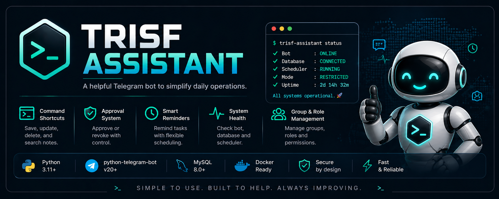

  

# trisf-assistant

**trisf-assistant** is a Dockerized Telegram group assistant built for internal team workflows.  
It helps manage shared notes, todos, reminders, approvals, group access control, moderation tools, on-call status, AFK notices, simple network diagnostics, backups, and runtime health checks — all scoped per group and backed by MySQL.

The Docker Compose stack starts both the bot and MySQL.  
The database initializes automatically from `sql/schema.sql` on first startup.

## Restricted Mode

With `BOT_MODE=restricted`, commands only work in chats listed in `allowed_groups`, unless the user is included in `SUPERUSER_IDS`.  
Superusers can bootstrap access for a new group using `/allowgroup`.

## Command Quick Reference

| Area | Commands |
| --- | --- |
| Notes | `/save`, `/update`, `/delete`, `/notes`, `/<key>` |
| Todos | `/todo` |
| Reminders | `/remind` |
| Approvals | `/approve`, `/revoke`, `/approvelist` |
| Group access | `/allowgroup`, `/removegroup`, `/allowedgroups`, `/allowlist`, `/groups` |
| On-call | `/oncall` |
| AFK | `/afk` |
| Audit | `/audit` |
| Backup | `/export`, `/import` |
| Health | `/health`, `/status` |
| Network | `/ping`, `/dns`, `/http`, `/whois` |
| Utilities | `/pw`, `/coffee` |
| Messages | `/pin`, `/unpin`, `/ghost` |
| Moderation | `/promote`, `/demote`, `/admins`, `/del`, `/kick`, `/ban`, `/unban`, `/purge` |

Full usage guide: [docs/documentation.md](docs/documentation.md)
